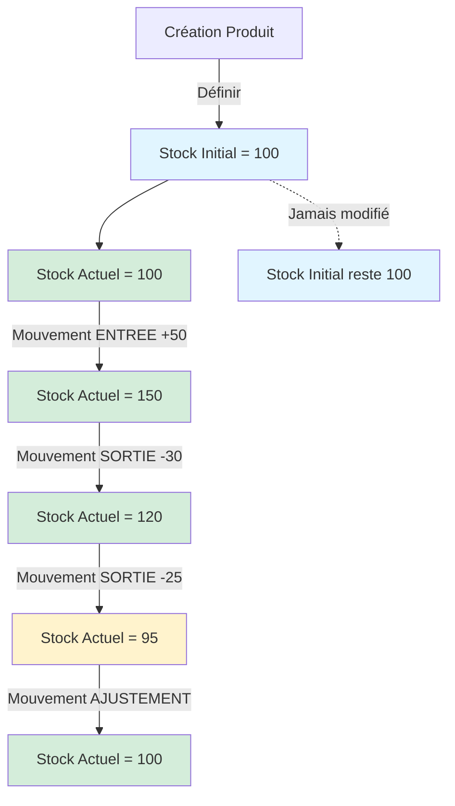

# Documentation : Gestion du Stock

## Vue d'ensemble

Le système de gestion de stock dans l'application UniVet utilise deux concepts distincts mais complémentaires :
1. **Stock Initial** : Une valeur de référence définie lors de la création du produit
2. **Mouvements de Stock** : Un historique complet de toutes les transactions affectant le stock

---

## 1. Stock Initial vs Mouvements de Stock

### 🔵 Stock Initial (`stockInitial`)

Le **stock initial** est un champ de l'entité `Produit` qui représente :

- **Définition** : La quantité de départ du produit lors de son enregistrement dans le système
- **Utilisation** : Point de référence historique uniquement
- **Modification** : Ne change jamais après la création du produit
- **Localisation** : Stocké dans la table `produit`, colonne `stock_initial`

#### Exemple
```php
$produit = new Produit();
$produit->setNom("Vaccin Antirabique");
$produit->setStockInitial(100.0); // 100 unités au départ
```

> [!IMPORTANT]
> Le stock initial **N'EST PAS** le stock actuel. C'est uniquement une valeur de référence historique qui indique combien d'unités vous aviez au moment de créer le produit dans le système.

---

### 🟢 Mouvements de Stock (`MouvementStock`)

Les **mouvements de stock** sont des enregistrements qui tracent chaque transaction :

- **Définition** : Chaque entrée, sortie, ajustement ou retour de produit
- **Utilisation** : Calcul du stock actuel en temps réel
- **Modification** : Nouveaux mouvements ajoutés continuellement
- **Localisation** : Stockés dans la table `mouvement_stock`

#### Types de mouvements

| Type | Description | Impact sur le stock |
|------|-------------|---------------------|
| **ENTREE** | Réception de marchandise | ➕ Augmente le stock |
| **SORTIE** | Vente ou utilisation | ➖ Diminue le stock |
| **AJUSTEMENT** | Correction d'inventaire | ➕/➖ Ajuste au nouveau stock |
| **RETOUR** | Retour client/fournisseur | ➕ Augmente le stock |

---

## 2. Calcul du Stock Actuel

### Formule

Le **stock actuel** d'un produit est calculé dynamiquement :

```
Stock Actuel = Stock Initial + Σ(Mouvements)
```

Où :
- **Stock Initial** = Valeur définie à la création
- **Σ(Mouvements)** = Somme de tous les mouvements (ENTREE et RETOUR en positif, SORTIE en négatif)

### Exemple concret

Prenons un produit "Vaccin Antirabique" :

#### Étape 1 : Création du produit
```php
Stock Initial = 100 unités
Stock Actuel = 100 unités (aucun mouvement)
```

#### Étape 2 : Réception de marchandise
```php
Mouvement : ENTREE de 50 unités
Stock Actuel = 100 + 50 = 150 unités
```

#### Étape 3 : Vente
```php
Mouvement : SORTIE de 30 unités
Stock Actuel = 150 - 30 = 120 unités
```

#### Étape 4 : Ajustement d'inventaire
```php
Inventaire physique : 115 unités trouvées
Mouvement : AJUSTEMENT (différence de -5)
Stock Actuel = 115 unités
```

### Implémentation technique

Le calcul est effectué par le `MouvementStockRepository` :

```php
public function getStockActuel(Produit $produit): float
{
    $qb = $this->createQueryBuilder('m')
        ->select('p.stockInitial + 
                  SUM(CASE 
                      WHEN m.type = :entree THEN m.quantite
                      WHEN m.type = :sortie THEN -m.quantite
                      WHEN m.type = :retour THEN m.quantite
                      WHEN m.type = :ajustement THEN (m.stockApres - m.stockAvant)
                      ELSE 0
                  END) as stockActuel')
        ->join('m.produit', 'p')
        ->where('m.produit = :produit')
        ->setParameter('produit', $produit)
        ->setParameter('entree', TypeMouvement::ENTREE)
        ->setParameter('sortie', TypeMouvement::SORTIE)
        ->setParameter('retour', TypeMouvement::RETOUR)
        ->setParameter('ajustement', TypeMouvement::AJUSTEMENT)
        ->groupBy('p.id');

    return (float) $qb->getQuery()->getSingleScalarResult();
}
```

---

## 3. Workflow d'utilisation

### 📝 Lors de la création d'un produit

1. **Remplir le formulaire produit** :
   - Nom, code, description
   - **Stock Initial** : Quantité que vous avez actuellement
   - **Stock Minimum** : Seuil d'alerte
   - Prix d'achat et de vente

2. **Enregistrer le produit** :
   - Le stock initial est sauvegardé
   - **Aucun mouvement de stock n'est créé automatiquement**
   - Le stock actuel = stock initial (car aucun mouvement)

> [!WARNING]
> Le stock initial est une valeur **statique** qui ne sera jamais modifiée. Pour gérer le stock par la suite, utilisez les mouvements de stock.

---

### 📦 Après la création : Gestion du stock

Pour toute modification du stock, utilisez les **mouvements de stock** :

#### A. Réception de marchandise
**Route** : `/stock/entree`

```php
// Exemple : Réception de 50 unités
Type : ENTREE
Quantité : 50
Motif : "Commande fournisseur #12345"
Référence : "BL-2024-001"
```

#### B. Vente ou utilisation
**Route** : `/stock/sortie`

```php
// Exemple : Vente de 20 unités
Type : SORTIE
Quantité : 20
Motif : "Vente client"
Référence : "FACT-2024-042"
```

#### C. Inventaire physique
**Route** : `/stock/ajustement`

```php
// Exemple : Inventaire trouve 95 unités au lieu de 100
Type : AJUSTEMENT
Quantité : 95 (nouveau stock total)
Motif : "Inventaire mensuel - décembre 2024"
```

> [!TIP]
> Pour l'ajustement, entrez le **stock total réel** trouvé lors de l'inventaire, pas la différence. Le système calcule automatiquement la différence.

#### D. Retour client/fournisseur
**Route** : `/stock/entree` (avec motif "Retour")

```php
// Exemple : Retour de 5 unités
Type : RETOUR
Quantité : 5
Motif : "Retour client - produit défectueux"
Référence : "RET-2024-003"
```

---

## 4. Différences clés résumées

| Aspect | Stock Initial | Mouvements de Stock |
|--------|---------------|---------------------|
| **Quand ?** | À la création du produit | Après la création, en continu |
| **Fréquence** | Une seule fois | Multiples fois |
| **Modification** | Jamais modifié | Nouveaux mouvements ajoutés |
| **Objectif** | Référence historique | Gestion quotidienne du stock |
| **Visibilité** | Champ du formulaire produit | Module "Gestion de Stock" |
| **Impact** | Base de calcul initiale | Modifie le stock actuel |

---

## 5. Cas d'usage pratiques

### Scénario 1 : Nouveau produit avec stock existant

Vous recevez un nouveau produit "Antibiotique XYZ" et vous avez 200 unités en stock.

**✅ Bonne pratique** :
```
1. Créer le produit avec stockInitial = 200
2. Le stock actuel sera automatiquement 200
3. Pas besoin de créer un mouvement d'entrée
```

**❌ Erreur courante** :
```
1. Créer le produit avec stockInitial = 0
2. Créer un mouvement ENTREE de 200
   → Complexité inutile et historique confus
```

---

### Scénario 2 : Réception de marchandise

Vous recevez 100 unités supplémentaires d'un produit existant.

**✅ Bonne pratique** :
```
1. Aller dans "Stock" → "Entrée de stock"
2. Sélectionner le produit
3. Quantité : 100
4. Motif : "Commande fournisseur #XXX"
5. Référence : Numéro de bon de livraison
```

**❌ Ne PAS faire** :
```
Modifier le stockInitial du produit
→ Cela fausserait l'historique !
```

---

### Scénario 3 : Inventaire physique

Lors de l'inventaire, vous comptez 85 unités alors que le système indique 100.

**✅ Bonne pratique** :
```
1. Aller dans "Stock" → "Ajustement"
2. Sélectionner le produit
3. Quantité : 85 (le stock réel compté)
4. Motif : "Inventaire physique - [date]"
5. Le système créera un ajustement de -15
```

---

## 6. Traçabilité et audit

Chaque mouvement de stock enregistre :

| Champ | Description |
|-------|-------------|
| `type` | Type de mouvement (ENTREE, SORTIE, etc.) |
| `quantite` | Quantité du mouvement |
| `stockAvant` | Stock avant le mouvement |
| `stockApres` | Stock après le mouvement |
| `dateCreation` | Date et heure du mouvement |
| `user` | Utilisateur ayant effectué le mouvement |
| `motif` | Raison du mouvement |
| `reference` | Référence externe (BL, facture, etc.) |

### Exemple d'historique

```
Produit : Vaccin Antirabique
Stock Initial : 100

Historique des mouvements :
┌──────────────┬────────┬──────────┬────────────┬─────────────┬──────────────────┐
│ Date         │ Type   │ Quantité │ Stock Avant│ Stock Après │ Motif            │
├──────────────┼────────┼──────────┼────────────┼─────────────┼──────────────────┤
│ 01/12 10:00  │ ENTREE │ 50       │ 100        │ 150         │ Commande #123    │
│ 05/12 14:30  │ SORTIE │ 30       │ 150        │ 120         │ Vente client     │
│ 10/12 09:15  │ SORTIE │ 25       │ 120        │ 95          │ Utilisation      │
│ 15/12 16:00  │ AJUST. │ 5        │ 95         │ 100         │ Inventaire       │
└──────────────┴────────┴──────────┴────────────┴─────────────┴──────────────────┘

Stock Actuel : 100 unités
```

---

## 7. Alertes et surveillance

Le système surveille automatiquement :

### 🔴 Rupture de stock
```
Stock Actuel ≤ 0
→ Badge rouge "Rupture"
→ Apparaît dans le tableau de bord
```

### 🟡 Alerte stock faible
```
0 < Stock Actuel < Stock Minimum
→ Badge orange "Alerte"
→ Apparaît dans "Produits à commander"
```

### 🟢 Stock normal
```
Stock Actuel ≥ Stock Minimum
→ Badge vert "OK"
```

---

## 8. Routes et interfaces

| Route | Fonction | Description |
|-------|----------|-------------|
| `/stock` | Vue d'ensemble | Liste tous les produits avec leur stock actuel |
| `/stock/dashboard` | Tableau de bord | Alertes, ruptures, valeur du stock |
| `/stock/entree` | Entrée de stock | Enregistrer une réception |
| `/stock/sortie` | Sortie de stock | Enregistrer une vente/utilisation |
| `/stock/ajustement` | Ajustement | Corriger le stock (inventaire) |
| `/stock/mouvements` | Historique global | Tous les mouvements récents |
| `/stock/produit/{id}` | Historique produit | Mouvements d'un produit spécifique |

---

## 9. Bonnes pratiques

### ✅ À faire

1. **Définir le stock initial** lors de la création du produit
2. **Utiliser les mouvements** pour toute modification ultérieure
3. **Documenter chaque mouvement** avec un motif clair
4. **Ajouter des références** (BL, factures) pour la traçabilité
5. **Faire des inventaires réguliers** avec ajustements
6. **Définir des stocks minimums** pertinents

### ❌ À éviter

1. ❌ Modifier le stock initial après création
2. ❌ Créer des mouvements sans motif
3. ❌ Faire des ajustements fréquents (signe de problème)
4. ❌ Oublier de vérifier les alertes de stock
5. ❌ Négliger la traçabilité des mouvements

---

## 10. FAQ

### Q1 : Puis-je modifier le stock initial après création ?
**R** : Techniquement oui, mais **fortement déconseillé**. Cela fausserait tout l'historique. Utilisez plutôt un ajustement de stock.

### Q2 : Que se passe-t-il si je crée un produit avec stock initial = 0 ?
**R** : Le stock actuel sera 0. Vous devrez ensuite créer un mouvement ENTREE pour ajouter du stock.

### Q3 : Comment corriger une erreur de saisie ?
**R** : Créez un mouvement d'ajustement avec le stock réel et un motif explicatif (ex: "Correction erreur de saisie du [date]").

### Q4 : Le stock initial est-il utilisé dans les calculs ?
**R** : Oui, il sert de base de calcul : `Stock Actuel = Stock Initial + Σ(Mouvements)`

### Q5 : Puis-je supprimer un mouvement de stock ?
**R** : Pour des raisons d'audit, la suppression n'est pas recommandée. Créez plutôt un mouvement inverse avec un motif explicatif.

### Q6 : Comment gérer un retour client ?
**R** : Utilisez un mouvement de type RETOUR avec la quantité retournée et la référence du retour.

---

## 11. Schéma récapitulatif



---

## Conclusion

La distinction entre **stock initial** et **mouvements de stock** est fondamentale :

- Le **stock initial** est une **photographie** du stock à un instant T (création du produit)
- Les **mouvements de stock** sont un **film** de toutes les transactions

Cette séparation permet :
- ✅ Une traçabilité complète
- ✅ Un audit précis
- ✅ Une gestion en temps réel
- ✅ Un historique fiable

**Règle d'or** : Créez le produit avec le stock initial, puis gérez tout via les mouvements de stock !
